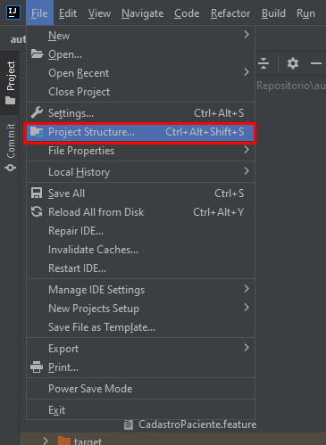
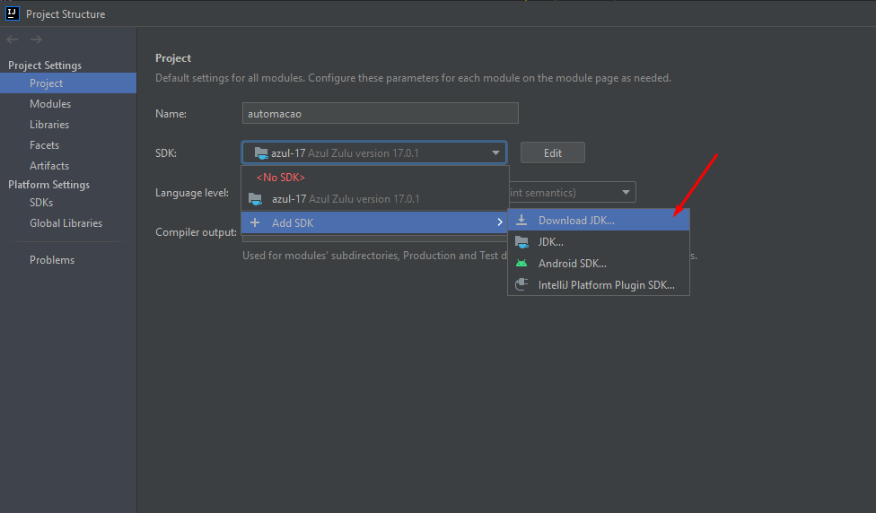
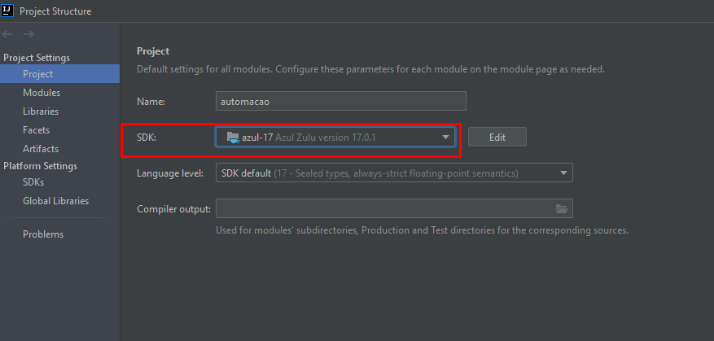

# QA

## Como utilizar a automação
- IDE 
    Foi utilizada é o Intellij, para baixar basta seguir os passos do link.
    A automação foi desenvolvida seguindo o planejamento e ferramentas:
  - [Mapa mental](https://miro.com/welcomeonboard/T05MTk8zYjdGNTc2Tnk0UnJ1YTJPbDZjbmMxd3pLdm1YMTB4WjRPb2k2S3Z0Zm5seVdBTlYzNHNZMExEWTdqMXwzNDU4NzY0NTE1MzQzNTcyNzUw?invite_link_id=73210661545)

- Git Flow
  - É necessário baixar o git bash para ser possível interagir com a automação no gitlab, [link para download.](https://git-scm.com/download/win)

## Comandos

- `mvn clean test` roda todos os testes

## Dependências

- [Maven](https://maven.apache.org/install.html) - adicionar às variáveis de ambiente
 
- JAVA - adicionar às variáveis de ambiente
  - É necessário baixar JDK versão 17.01, é possível fazer isso após clonar o projeto e acessar através do Intellij, como mostra a imagem abaixo:
  
    
    
    

- Selenium
  - Primeiramente é necessário instalar o node, [link de com o passo-a-passo](https://dicasdejavascript.com.br/instalacao-do-nodejs-e-npm-no-windows-passo-a-passo/)
  - Em seguida no cmd executar a seguinte linha de comando:`npm install selenium-webdriver `
  - Arquivo chromedriver.exe deve estar na versão do Chrome que você utiliza

- Pluggins instalar na IDE
  - CUCUMBER
  - ALLURE*

- Report:
  O relatório com resultado da automação é disponibilizado no Alllure, toda vez que a automação é executada
  - Descrever Passo-a-passo de como configurar Allure

**Importante!**

**Para rodar a automação a VPN deve estar conectada**
